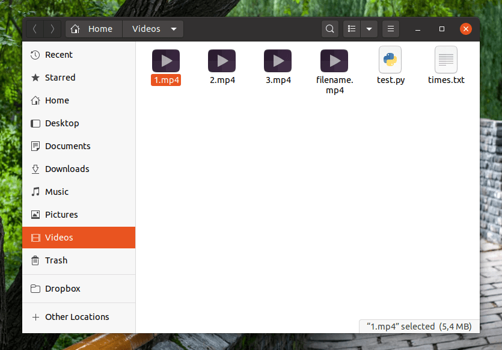

# split-videos

Split Videos into smaller clips. For example, 1 minute video into 3 videos of 20 seconds to upload as facebook stories.

## Requirements

First, make sure you have Python3 installed on your Windows or Linux distribution, and also make sure that `pip` is installed. Then, run the following `pip` command to install the needed Python module to do the work, which is `moviepy`:

```
pip3 install moviepy
```

Then, create 2 files in your current working directory:

- `split.py`: Which will contain the Python script
- `times.txt`: Which should contain the start and end times you want for the clips.

<p><br>Let’s say that your original video that you are trying to clip is **20 minutes long**, and you want to create **3 smaller videos**, the first one is from the start and till 1 minute **(from 0 to 60 seconds)**, the second one is between **1:00 and 1:20**, and the 3rd one is between **1:40 and 2:00**). Then, your `times.txt` file contents should be the following:</p>

```
0-60
60-80
100-120
```

Notice how we needed to convert the format from **1:00** to **60** (always in seconds).

You can add whatever number of lines you like into that file. E.g if you want to create 100 smaller clip, then you can do it. Just make sure that you follow the exact same format: `start_time-end_time` (With no spaces in between, and each one in its own separate line).

## The Python Script

Now, coming to the important part, here’s the code that you need to put in your `split.py` Python file:

```
#!/usr/bin/env python
from moviepy.video.io.ffmpeg_tools import ffmpeg_extract_subclip
# Replace the filename below.
required_video_file = "filename.mp4"
with open("times.txt") as f:
  times = f.readlines()
times = [x.strip() for x in times]
for time in times:
  starttime = int(time.split("-")[0])
  endtime = int(time.split("-")[1])
  ffmpeg_extract_subclip(required_video_file, starttime, endtime, targetname=str(times.index(time)+1)+".mp4")
```

Replace the name of the file `filename.mp4` with the name of the video file you have (It must be in the same current working directory). If you were trying to clip other formats such as `.webm` and `.avi`, then simply replace all the occurrences of `.mp4` in the Python script with the format you desire. (There are just two of them; In the name of the file you entered and in the last line of the code).

Now, run the Python code with:

```
python3 split.py
python split.py # if the previous one didn't work.
```

And see the 3 video files are created and working!

